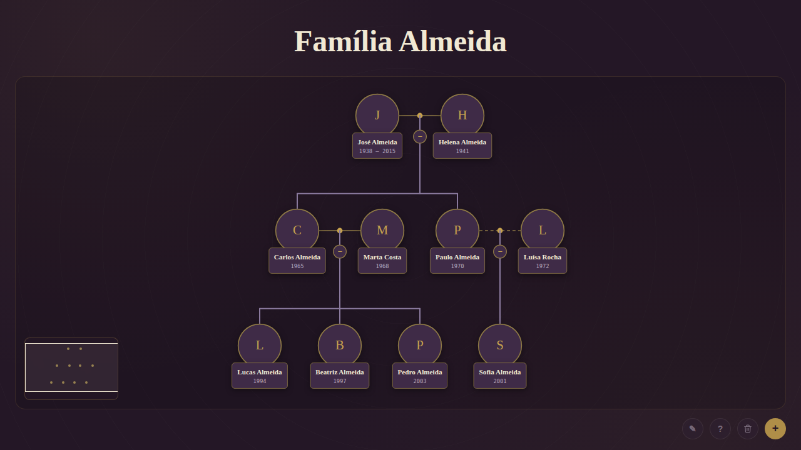
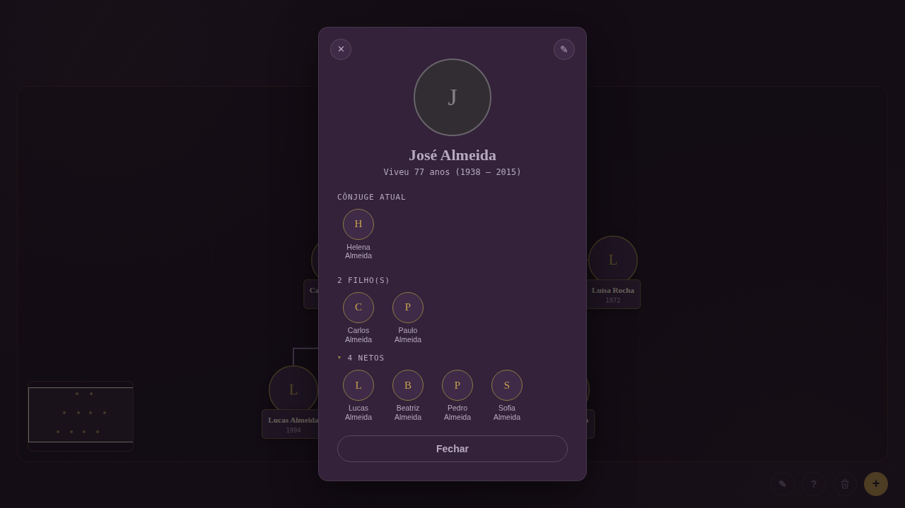
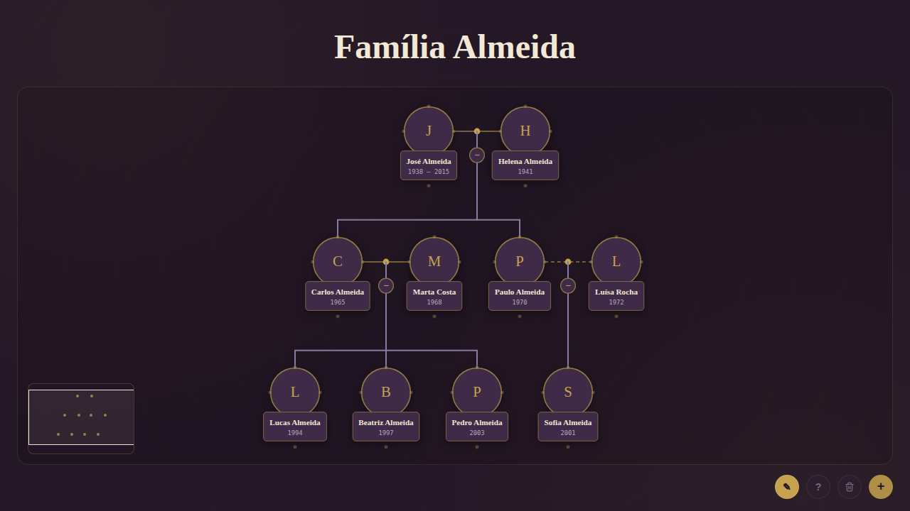
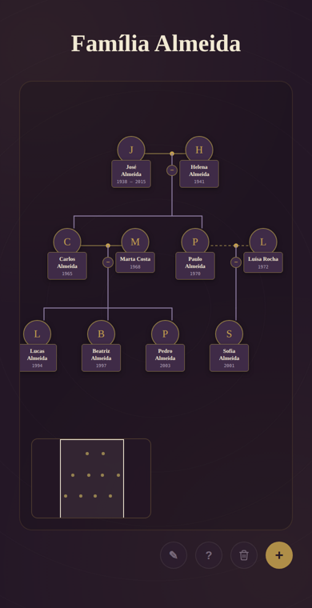

<div align="center">

# 🌳 Árvore Genealógica

**Uma árvore genealógica interativa, visual e colaborativa, que roda direto no navegador.**

Monte a história da sua família arrastando pessoas e ligações num quadro infinito.
Tudo fica salvo na nuvem e sincronizado em tempo real entre todos que estiverem com a árvore aberta.




<sub>Imagens geradas com uma família fictícia de exemplo.</sub>

</div>

---

## 📑 Sumário

- [Visão geral](#-visão-geral)
- [Funcionalidades](#-funcionalidades)
- [Como usar](#️-como-usar)
- [Tecnologias](#️-tecnologias)
- [Instalação e configuração](#-instalação-e-configuração)
- [Modelo de dados](#️-modelo-de-dados)
- [Arquitetura do código](#-arquitetura-do-código)
- [Segurança e privacidade](#-segurança-e-privacidade)
- [Backup e recuperação](#-backup-e-recuperação)
- [Próximos passos](#️-próximos-passos)

---

## 🔎 Visão geral

A aplicação é **um único arquivo `index.html`**, sem build, sem framework e sem servidor próprio. O navegador cuida da interface e o [Supabase](https://supabase.com) guarda os dados, as fotos e envia as atualizações em tempo real.

- **Quadro livre:** as pessoas ficam num canvas com zoom e navegação, organizadas por gerações.
- **Ligações por arrastar:** pais, filhos e cônjuges são conectados arrastando pontos de uma pessoa até outra.
- **Colaborativo:** quando alguém edita, quem estiver com a árvore aberta vê a mudança na hora.
- **Feito para celular:** tem um modo "somente navegação" que impede mover ou desconectar algo sem querer, além de gesto de pinça para zoom.

---

## ✨ Funcionalidades

### 👤 Pessoas

| Recurso | Descrição |
|---|---|
| **Cadastro** | Nome completo, ano de nascimento, ano de falecimento (opcional) e foto. |
| **Foto** | A imagem é redimensionada no navegador (máx. 480 px, JPEG 85%) e enviada ao Supabase Storage. Sem foto, aparece a inicial do nome. |
| **Posicionamento automático** | Uma pessoa nova surge no centro da tela, na geração correspondente, num espaço livre. |
| **Edição** | Pelo lápis no perfil da pessoa. |
| **Exclusão em cascata** | Ao excluir alguém, os descendentes também são removidos, e o sistema avisa quantas pessoas serão afetadas antes de confirmar. |
| **Falecidos** | Quem tem ano de falecimento aparece com foto em tons de cinza e nome esmaecido no perfil. |

### 🔗 Relações

| Recurso | Descrição |
|---|---|
| **Pai/mãe e filho(a)** | Arraste o ponto do **topo** (é filho de…) ou da **base** (é pai/mãe de…) até outra pessoa. |
| **Cônjuges** | Arraste um dos pontos **laterais** até outra pessoa. |
| **Filhos do casal** | Arraste a **bolinha dourada** entre os cônjuges até o filho para ligá-lo aos dois pais de uma vez. |
| **Separados** | Clique na linha do casal para marcar como separados (a linha fica **tracejada**) ou casados novamente. |
| **Remover ligação** | Clique em qualquer linha de pais/filhos ou use o menu da linha do casal. |

### 🧭 Navegação e visualização

| Recurso | Descrição |
|---|---|
| **Pan e zoom** | Arraste o fundo para navegar. Use a roda do mouse ou a pinça no celular para dar zoom (de 30% a 250%). |
| **Minimapa** | Fica no canto inferior esquerdo e mostra a árvore inteira. Clique ou arraste nele para ir direto a um ponto. |
| **Gerações em faixas** | Cada geração ocupa uma faixa horizontal. Ao soltar uma pessoa em outra altura, ela muda de geração. |
| **Layout automático** | Um algoritmo recursivo agrupa os filhos de cada casal e centraliza os pais acima deles, evitando que ramos se cruzem. |
| **Retrair/expandir ramos** | Clique na bolinha do casal para esconder toda a descendência. Aparece um contador com o número de pessoas ocultas, e um novo clique traz o ramo de volta. |
| **Nome da família** | O título no topo é editável e salvo automaticamente. |

### 🪪 Perfil

Clique em uma pessoa para ver:

- idade atual, ou quantos anos viveu (ex.: *Viveu 77 anos (1938 – 2015)*);
- cônjuge atual;
- filhos;
- netos, bisnetos e trisnetos, em seções que abrem e fecham.

Cada mini-foto do perfil é clicável, então dá para navegar pela família toda sem voltar ao quadro.

<div align="center">
  
</div>

### ☁️ Dados e sincronização

| Recurso | Descrição |
|---|---|
| **Salvamento automático** | Toda alteração é gravada no Supabase na hora. |
| **Novas tentativas** | Se o salvamento falhar, o sistema tenta de novo após 0,7 s, 1,8 s e 3,5 s. |
| **Backup de emergência** | Se todas as tentativas falharem, um arquivo `.json` de backup é baixado automaticamente e o usuário é avisado. |
| **Tempo real** | Alterações feitas em outro dispositivo aparecem sozinhas, via Supabase Realtime. |
| **Backup manual** | Baixe ou importe um `.json` pela tela de Ajuda (**?**). |

---

## 🕹️ Como usar

### Barra de ferramentas (canto inferior direito)

| Botão | Ação |
|:---:|---|
| **✎** | Liga ou desliga o **modo de edição**. |
| **?** | Abre a ajuda e as opções de backup. |
| **🗑** | Apaga a árvore inteira, com confirmação. |
| **+** | Adiciona uma pessoa. |

### Modo de navegação × modo de edição

<table>
<tr>
<td width="50%" valign="top">

**Navegação (padrão)**

- Arrastar em qualquer lugar só move o quadro.
- Tocar numa pessoa abre o perfil.
- Nada é movido ou desconectado por engano, o que é ideal para celular.

</td>
<td width="50%" valign="top">

**Edição (lápis ativo)**

- Arraste a foto para reposicionar a pessoa.
- Aparecem **4 pontos** ao redor de cada foto para criar ligações.
- As linhas podem ser removidas com um clique.

</td>
</tr>
</table>

<div align="center">
  
</div>

### Os 4 pontos de ligação

```
                ●  topo   → "é filho(a) de…"  (arraste até a pessoa ou até a bolinha do casal)
  lateral  ●  (foto)  ●  lateral  → "é cônjuge de…"
                ●  base   → "é pai/mãe de…"
```

### Gestos

| Ação | Computador | Celular |
|---|---|---|
| Mover o quadro | Arrastar o fundo | Arrastar com um dedo |
| Zoom | Roda do mouse | Pinça com dois dedos |
| Abrir perfil | Clicar na pessoa | Tocar na pessoa |
| Ir para uma área | Clicar no minimapa | Tocar no minimapa |

<div align="center">
  
</div>

---

## 🛠️ Tecnologias

| Camada | Tecnologia |
|---|---|
| Interface | HTML5 + CSS3 (variáveis CSS, layout responsivo) |
| Lógica | JavaScript puro (ES2017+), Pointer Events, Canvas API (para redimensionar fotos) |
| Conexões | SVG desenhado dinamicamente |
| Banco de dados | Supabase Postgres (tabela `family_tree_state`) |
| Arquivos | Supabase Storage (bucket `family-tree-photos`) |
| Tempo real | Supabase Realtime (`postgres_changes`) |
| Cliente | `@supabase/supabase-js@2` via CDN (jsDelivr) |
| Tipografia | Fraunces, Inter e IBM Plex Mono (Google Fonts) |

---

## 🚀 Instalação e configuração

### 1. Crie um projeto no Supabase

Crie um projeto gratuito em [supabase.com](https://supabase.com) e abra o **SQL Editor**.

### 2. Crie a tabela e a linha da árvore

```sql
create table public.family_tree_state (
  id                text primary key,
  family_name       text,
  people            jsonb not null default '[]'::jsonb,
  spouse_status     jsonb not null default '{}'::jsonb,
  collapsed_couples jsonb not null default '{}'::jsonb,
  updated_at        timestamptz default now()
);

-- A aplicação lê e atualiza sempre a linha com id = 'main'
insert into public.family_tree_state (id, family_name)
values ('main', 'Minha Árvore Genealógica');

-- Habilita o tempo real para a tabela
alter publication supabase_realtime add table public.family_tree_state;
```

### 3. Configure as permissões (RLS)

```sql
alter table public.family_tree_state enable row level security;

create policy "leitura da árvore" on public.family_tree_state
  for select to anon using (id = 'main');

create policy "edição da árvore" on public.family_tree_state
  for update to anon using (id = 'main') with check (id = 'main');
```

### 4. Crie o bucket de fotos

Em **Storage → New bucket**, crie o bucket `family-tree-photos` marcado como **Public**. Depois, libere o envio:

```sql
create policy "upload de fotos" on storage.objects
  for insert to anon with check (bucket_id = 'family-tree-photos');

create policy "substituir fotos" on storage.objects
  for update to anon using (bucket_id = 'family-tree-photos');
```

### 5. Aponte o `index.html` para o seu projeto

Em **Settings → API**, copie a URL do projeto e a chave pública (anon/publishable) e substitua no início do `<script>`:

```js
const SUPABASE_URL      = "https://SEU-PROJETO.supabase.co";
const SUPABASE_ANON_KEY = "sua-chave-publica";
const TREE_ROW_ID       = "main"; // troque para ter várias árvores no mesmo banco
```

### 6. Rode

Como é um arquivo estático, qualquer uma destas opções funciona:

```bash
# Abrir direto no navegador
start index.html        # Windows
open index.html         # macOS

# Ou servir localmente
npx serve .
python -m http.server 8000
```

**Publicar online:** ative o **GitHub Pages** em *Settings → Pages → Deploy from a branch → `main` / root*, ou suba o arquivo em qualquer hospedagem estática (Vercel, Netlify, Cloudflare Pages).

---

## 🗂️ Modelo de dados

Toda a árvore é guardada em **uma única linha** da tabela `family_tree_state`, e as pessoas ficam num array JSON.

```jsonc
{
  "family_name": "Família Almeida",
  "people": [
    {
      "id": "p_k3j9x2a1lq8z0",       // gerado por uid()
      "name": "Carlos Almeida",
      "birth": "1965",
      "death": "",                   // vazio = vivo
      "photo": "https://…/family-tree-photos/photo-….jpg",
      "generation": 1,               // faixa vertical (0 = topo)
      "x": 480, "y": 370,            // posição no quadro
      "parentIds": ["p_jose", "p_helena"],
      "spouseIds": ["p_marta"]
    }
  ],
  "spouse_status":     { "p_marta|p_carlos": "married" },   // ou "separated"
  "collapsed_couples": { "p_helena|p_jose": true }          // ramos retraídos
}
```

- As chaves de casal são os dois IDs **ordenados** e unidos por `|` (função `spouseKey`).
- As relações são **bidirecionais** para cônjuges (`spouseIds` nos dois lados). Para filiação, ficam só no filho (`parentIds`).
- O backup `.json` baixado pela aplicação tem exatamente esse formato.

---

## 🧩 Arquitetura do código

O `index.html` é dividido em três blocos: `<style>` (tema e layout), a marcação dos modais e um `<script>` com a lógica, organizado nos módulos abaixo.

<details>
<summary><strong>☁️ Armazenamento e sincronização</strong></summary>

| Função | O que faz |
|---|---|
| `loadState()` | Carrega a linha `main` do Supabase, completa dados antigos (posição, listas vazias), calcula gerações, monta o layout e ativa o tempo real. |
| `saveState()` | Grava o estado com até 3 novas tentativas e, se tudo falhar, baixa um backup automaticamente. |
| `subscribeRealtime()` | Escuta `UPDATE` na tabela e redesenha a árvore. Ignora o "eco" do próprio salvamento por 4 s. |
| `uploadPhotoBlob(blob)` | Envia a foto ao bucket `family-tree-photos` e retorna a URL pública. |
| `downloadBackup()` | Gera e baixa `<nome-da-familia>-backup.json`. |
| `importBackup(file)` | Valida e carrega um backup, salvando no Supabase em seguida. |

</details>

<details>
<summary><strong>👤 Pessoas e modais</strong></summary>

| Função | O que faz |
|---|---|
| `openAddModal()` / `openEditModal(id)` / `closeModal()` | Abrem e fecham o formulário de pessoa. |
| `savePerson()` | Valida, cria ou atualiza a pessoa e escolhe geração e posição a partir do centro da tela. |
| `deleteCurrentPerson()` | Remove a pessoa, os descendentes e as ligações órfãs. |
| `clearAllConfirm()` | Apaga a árvore inteira após confirmação. |
| `openProfile(id)` / `closeProfile()` | Montam o perfil com idade, cônjuge, filhos, netos, bisnetos e trisnetos. |
| `showConfirm()` / `showAlert()` | Diálogos próprios (substituem `confirm`/`alert` do navegador). |
| `setEditMode(on)` | Alterna entre navegação e edição. |

</details>

<details>
<summary><strong>🔗 Relações</strong></summary>

| Função | O que faz |
|---|---|
| `applyHandleRelation(source, target, type)` | Cria a relação `child`, `parent` ou `spouse` e ajusta a geração. |
| `applyCoupleChild(a, b, child)` | Liga um filho aos dois pais de uma vez. |
| `attachHandleDrag()` / `startCoupleDrag()` | Arraste dos pontos de ligação e da bolinha do casal, com linha temporária e destaque do alvo. |
| `removeSpouseLink()` / `removeParentLink()` / `removeCoupleChildLink()` | Removem ligações após confirmação. |
| `getSpouseStatus()` / `setSpouseStatus()` / `clearSpouseStatus()` | Controlam o status casados/separados. |
| `openSpouseLineMenu()` | Abre o menu contextual da linha do casal. |

</details>

<details>
<summary><strong>🌲 Genealogia e layout</strong></summary>

| Função | O que faz |
|---|---|
| `getDescendants(id)` | Busca em largura (BFS) de todos os descendentes. |
| `getDescendantLevels(id, depth)` | Descendentes agrupados por nível: filhos, netos, bisnetos… |
| `getBranchClosure(ids)` | Ramo completo, incluindo os cônjuges dos descendentes (usado para retrair). |
| `getHiddenIds()` / `toggleCoupleCollapse()` | Controlam os ramos retraídos. |
| `fillMissingGenerations()` | Deduz a geração de quem ainda não tem uma, sem sobrescrever o que foi posicionado à mão. |
| `layoutTree()` | Layout recursivo de baixo para cima: agrupa os filhos de cada casal e centraliza os pais sobre eles. |
| `declutterX()` | Garante pelo menos 150 px entre pessoas da mesma geração. |
| `findNearbySpot()` / `setLevel()` | Encontram um espaço livre e posicionam a pessoa na faixa da geração. |

</details>

<details>
<summary><strong>🖼️ Renderização e navegação</strong></summary>

| Função | O que faz |
|---|---|
| `render()` / `buildCard(p)` / `positionCard()` | Desenham os cartões das pessoas. |
| `drawConnections()` | Desenha em SVG as linhas de casal (sólidas ou tracejadas), de filhos, as bolinhas e os contadores de ramos retraídos. |
| `attachCardDrag()` | Arrastar para mover no modo de edição, ou clique para abrir o perfil. |
| `applyTransform()` / `zoomAt()` | Pan e zoom (30%–250%) mantendo o ponto sob o cursor. |
| `renderMinimap()` / `navigateMinimap()` / `computeBounds()` | Minimapa com a área visível. |

</details>

### Constantes de layout

| Constante | Valor | Uso |
|---|---|---|
| `PHOTO_R` | 44 | Raio da foto (px) |
| `CARD_W` | 132 | Largura do cartão (px) |
| `SECTION_H` | 230 | Altura de cada faixa de geração (px) |
| `SECTION_Y0` | 140 | Posição vertical da primeira geração (px) |
| `MIN_SCALE` / `MAX_SCALE` | 0.3 / 2.5 | Limites do zoom |

---

## 🔐 Segurança e privacidade

- A chave usada no front-end é a **chave pública** (anon/publishable) do Supabase, feita para ficar exposta no navegador. **Nunca** coloque a `service_role` no `index.html`.
- Com as políticas da seção de instalação, **qualquer pessoa com o link da página pode ver e editar a árvore**. Isso é prático para uso em família, mas avalie o que publicar.
- As fotos ficam num bucket **público**. Qualquer um com a URL de uma foto consegue abri-la.
- Para restringir o acesso, uma opção é ativar o **Supabase Auth** e trocar `to anon` por `to authenticated` nas políticas.

---

## 💾 Backup e recuperação

1. Abra a **Ajuda (?)** e clique em **Baixar backup** de vez em quando.
2. Para restaurar, clique em **Importar backup** e escolha o `.json`. A árvore é substituída e salva no Supabase.
3. Se o salvamento na nuvem falhar repetidamente, a aplicação **baixa um backup sozinha** para evitar perda de dados.

---

## 🗺️ Próximos passos

Ideias para evoluir o projeto:

- [ ] Login com Supabase Auth e permissões por pessoa (visualizar × editar)
- [ ] Datas completas (dia/mês), local de nascimento e biografia
- [ ] Busca por nome com foco automático na pessoa
- [ ] Exportar a árvore como imagem ou PDF
- [ ] Várias árvores na mesma conta (usando `TREE_ROW_ID`)
- [ ] Desfazer/refazer

---

<div align="center">

Feito com 💜 por **[Fau](https://github.com/Fau009)**

</div>
